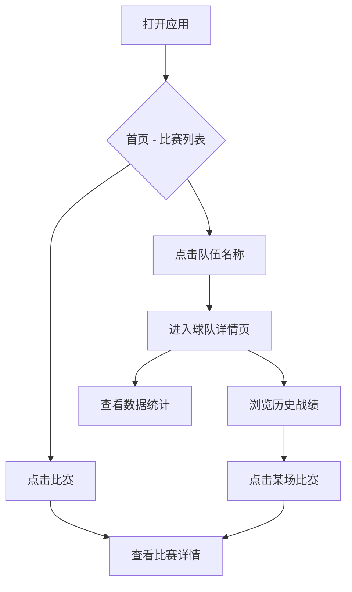

# 世界杯比赛信息应用 - 产品需求文档

## 1. 产品概述

一款展示世界杯实时比赛信息和历史数据的网页应用，帮助球迷快速获取赛程、比分、各队历史参赛记录等核心数据。支持桌面端和移动端访问，提供流畅的响应式体验。

**核心价值**：一站式获取世界杯比赛动态和历史数据，无需切换多个平台。

---

## 2. 功能模块

### 2.1 页面结构

| 页面名称 | 模块名称 | 功能描述 |
|---------|---------|---------|
| 首页 | 实时比赛列表 | 展示当前/即将进行的比赛，包括比分、状态、时间 |
| 首页 | 小组赛程 | 按小组分类展示完整赛程 |
| 球队详情页 | 球队信息 | 展示球队名称、队徽、世界杯参赛次数 |
| 球队详情页 | 历史战绩 | 展示该队历届世界杯的比赛记录（年份、对手、比分、阶段） |
| 球队详情页 | 数据统计 | 参赛场次、胜/平/负、进球数等汇总数据 |

### 2.2 核心功能

**首页 - 实时比赛列表**
- 显示正在直播、即将开始、已结束的比赛
- 比赛卡片展示：主队 Logo + 队名 + 比分 + 客队 Logo + 队名
- 点击比赛卡片进入比赛详情
- 点击队伍名称/Logo 进入该队详情页
- 实时更新比赛状态（每分钟刷新）

**首页 - 小组赛程**
- 按 A-H 八个小组展示赛程
- 每场比赛显示：时间、主客队、场地
- 支持小组筛选切换

**球队详情页**
- 展示球队基本信息（队名、队徽、成立年份）
- 历届世界杯成绩列表（可筛选：所有届次/近5届/近10届）
- 每场比赛记录包含：年份、阶段（小组赛/淘汰赛）、对手、比分、胜负
- 汇总统计：参赛届数、总场次、胜/平/负、总进球

---

## 3. 用户交互流程

---

## 4. 视觉设计

### 4.1 设计风格
- **主题**：体育/竞技风格，以深色为主（深蓝/深灰背景）
- **配色**：
  - 主色：#1a1a2e（深蓝黑）
  - 次色：#16213e（深蓝）
  - 强调色：#e94560（活力红）
  - 文字：#eaeaea（浅灰白）
  - 辅助：#0f3460（蓝色）
- **字体**：Oswald（标题）+ Inter（正文）
- **布局**：卡片式布局，圆角边框，悬停阴影效果

### 4.2 组件样式
- **比赛卡片**：深色卡片，悬停上浮 + 边框发光
- **球队标签**：圆角胶囊样式，主队/客队区分
- **数据统计**：数字突出显示，使用强调色
- **按钮**：圆角矩形，悬停变色 + 缩放效果

### 4.3 响应式设计
- **桌面端（>1024px）**：双栏/三栏网格布局
- **平板端（768-1024px）**：双栏布局
- **移动端（<768px）**：单栏堆叠布局，底部导航

---

## 5. 数据说明

### 5.1 实时数据
- 使用公开的世界杯 API 获取实时比分
- 备选数据源：哲狐等体育数据API
- 无 API 时使用模拟数据展示

### 5.2 历史数据
- 包含 1930 年至今所有世界杯比赛记录
- 数据字段：年份、阶段、对手、比分、胜负、进球

---

## 6. 非功能性需求

- **性能**：首屏加载 < 3秒
- **兼容性**：Chrome、Safari、Firefox、Edge 最新两个版本
- **移动端**：iOS Safari、Android Chrome 触控优化
