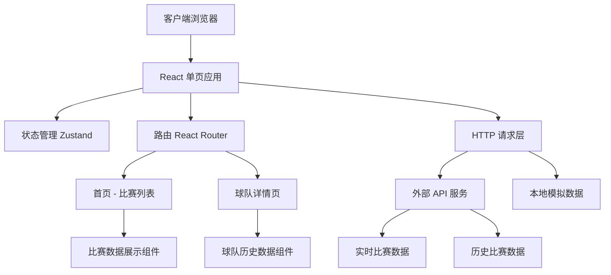

# 世界杯比赛信息应用 - 技术架构文档

## 1. 架构设计



**架构说明**：
- 前端单页应用（React + TypeScript）
- 路由管理：React Router v6
- 状态管理：Zustand
- 样式方案：Tailwind CSS
- 数据获取：React Query + fetch

---

## 2. 技术选型

| 技术 | 版本 | 用途 |
|-----|------|-----|
| React | 18.x | UI 框架 |
| TypeScript | 5.x | 类型安全 |
| Vite | 5.x | 构建工具 |
| Tailwind CSS | 3.x | 样式框架 |
| Zustand | 4.x | 状态管理 |
| React Router | 6.x | 路由管理 |
| Lucide React | 最新 | 图标库 |

---

## 3. 路由定义

| 路由路径 | 页面名称 | 功能描述 |
|---------|---------|---------|
| `/` | 首页 | 实时比赛列表 + 小组赛程 |
| `/team/:teamCode` | 球队详情页 | 球队信息 + 历史战绩 |

---

## 4. 页面组件结构

```
src/
├── pages/
│   ├── HomePage.tsx          # 首页
│   └── TeamDetailPage.tsx    # 球队详情页
├── components/
│   ├── MatchCard.tsx         # 比赛卡片组件
│   ├── MatchList.tsx         # 比赛列表组件
│   ├── TeamInfo.tsx          # 球队信息组件
│   ├── TeamHistory.tsx       # 球队历史战绩组件
│   ├── TeamStats.tsx         # 球队数据统计组件
│   └── Navigation.tsx        # 导航组件
├── hooks/
│   ├── useMatches.ts         # 比赛数据 Hook
│   └── useTeamData.ts        # 球队数据 Hook
├── store/
│   └── appStore.ts           # Zustand 全局状态
├── data/
│   ├── mockMatches.ts        # 模拟比赛数据
│   └── mockTeams.ts          # 模拟球队数据
└── types/
    └── index.ts              # TypeScript 类型定义
```

---

## 5. 数据模型

### 5.1 比赛数据

```typescript
interface Match {
  id: string;
  date: string;
  time: string;
  stage: 'group' | 'round16' | 'quarter' | 'semi' | 'final';
  group?: string;
  homeTeam: Team;
  awayTeam: Team;
  homeScore: number;
  awayScore: number;
  status: 'live' | 'upcoming' | 'finished';
  venue: string;
}
```

### 5.2 球队数据

```typescript
interface Team {
  code: string;
  name: string;
  logo: string;
  founded: number;
}

interface TeamHistory {
  teamCode: string;
  participations: Participation[];
  stats: TeamStats;
}

interface Participation {
  year: number;
  stage: string;
  matches: MatchRecord[];
}

interface MatchRecord {
  opponent: string;
  score: string;
  result: 'win' | 'draw' | 'loss';
  goalsFor: number;
  goalsAgainst: number;
}

interface TeamStats {
  totalParticipations: number;
  totalMatches: number;
  wins: number;
  draws: number;
  losses: number;
  totalGoals: number;
}
```

---

## 6. 状态管理

使用 Zustand 管理以下状态：

```typescript
interface AppState {
  // 比赛数据
  matches: Match[];
  loading: boolean;

  // 球队数据
  selectedTeam: Team | null;
  teamHistory: TeamHistory | null;

  // UI 状态
  activeGroup: string;
  setActiveGroup: (group: string) => void;
}
```

---

## 7. 响应式断点

| 设备 | 断点 | 布局 |
|-----|------|-----|
| 桌面 | ≥1024px | 多栏网格 |
| 平板 | 768-1023px | 双栏 |
| 移动 | <768px | 单栏 + 底部导航 |
